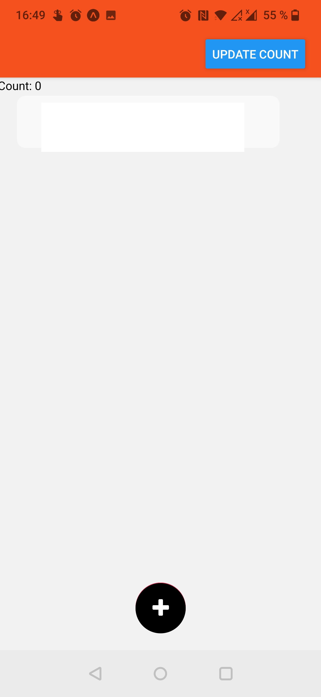

# **FLOATING ACTION BUTTON - PETALS VERSION**

## **Introduction**
Floating buttons that pop out like petals of a flower bloom... after pressing a bottom-central '+' button!

 
 

Derived from shevon14's repo: https://github.com/shevon14/FloatingActionButton-RN/ (hence the fork).

You can set the number of icons (petals) you want, and you can style them in styles.

## **TODOs**
- rework the styles to have buttons aligned correctly when overlaid on top of a view
- offer classic use cases: overlay on custom view, overlay on (almost) full-screen map
- comment styling in the scenario of "Bare" use (which is unlikely)
- resize all images of the README as done for the petals intro pic above

## **Motivations**
I started working on a React Native app project, where all I need is:
- a main screen,
- a help screen (or modal)
- potentially a "welcome screen"  

The main interactions for the user would be the ability to draw and pinpoint directly on the main screen, so I did not need a very complex Navigation structure.  

So I decided to look into simple alternatives to Navigation stacks/drawers/bars, etc... which made me land on the FloatingActionButton-RN repo.  

However, I found the following limitations in the code logics:
- `Animated.Value`, **not `Animated.ValueXY`**, which allows 1-direction translations, and limited (X, Y) translation when fiddling as done in the original repo
- The corner design is discrete, but **when your palette needs more than 4 or 5 icons, either you project them further, or the icons get stacked very close to each others.** This is not very user friendly as it can fill a significant part of the screen.
- My main use case was to guarantee great visibility of most of the screen at all times, with equal visibility in the width of the screen, so without blocking one side of the screen and not the other... basically **introducing symetry**

## **Values that look not too bad**
I had a bit of fun trying out different values below, that render the petal icons as displayed on the previews. Feel free to experiment!

**Initial (centerX, centerY) to position the menu '+' icon at the bottom center of the screen (tested visually with Android):**  
- `const centerX = 0.5*(Dimensions.get('window').width - styles.circle.width);`  
- `const default_height_offset = 260;`  
- `const centerY = Dimensions.get('window').height - default_height_offset;` 

It renders like this:  
 

Hereafter is a table containing values tried out, with a screenshot showing how they render (on an Android device). Don't hesitate to feed with your own examples if you want to!

| nb of icons (`iconQty`) | petals dim (`width`*`height` in `styles.petal`) | `distToCenter` (px) | `PISectorDivider` (float) | Preview + Comments on rendering |
| -- | -- | -- | -- | -- |
| odd number | any | any | 2 | In a scenario with >= 3 icons, the 0°/90°/180° axes will be filled with petals, always, so using a Math.PI/2 = 90° sector is going to look regular and filled for any odd qty of icons >= 3. **---> see how it renders below for iconQty = 3 and iconQty = 5!** |
| even number | any | any | 1 (or ~ 1 e.g 2/1.8) | When starting at 0°, Math.PI can be shared evenly from iconQty = 2*n, with n is a positive integer > 1.    An alternative is to start with an offset from the 0° axis. The complexity with the offset + even iconQty number is that the symetry along y axis can have a weird rendering on either side of y, if the sector division is not handled properly - which can appear visually "empty". For more details about it,  please read comments in `generatePetalsCoord()` in `PetalsCalc.js` file!   - You can also play with `width` in `ButtonStyles.js`, an offset, and make the icons almost look like a pawprint!  
| 2 | 60 x 60 | 60 | 2 | If 2 options only, then here is your compact Mickey Mouse! :) |
| 3 | 60 x 60 | 60 | 2 | If 3 options only, then here is a compact molecule kind of design :)   |
| 4 | 60 x 60 | 80-150 | 1 | A perfect semi-flower! Towards 150px, almost reach end of screen width.   80-100px is more compact, 100 a good compromise between breathy design and compactness.   |
| 5 | 60 x 60 | 85 | 2 | 85 px makes icons close enough, good compromise between clarity and compactness.   |
| *TBA* | *TBA* | *TBA* | *TBA* | *Don't hesitate to complete here in the README with your own observations!* |

## **Contributions welcome**
- Don't hesitate to experiment and give your feedback!
- If you have ideas on how to refactor the code, make it more compact e.g. for Animated.timing and Animated.View generating, please don't hesitate to contribute to this repo and/or the original one!
- You can also play with `Animated.timing duration` - I set `500` (ms) as default, or even modify a bit the `Animated.timing` sequence itself, e.g. to make the petals bloom from right to left, one after the other!

- Link towards FontAwesome names:
https://github.com/oblador/react-native-vector-icons/blob/master/glyphmaps/FontAwesome.json

***
Original portion of the README below:
# **FAB UI**

An animated/ expandable floating action button UI built using react native..

Screen -

 

## Tech Stack -

* React Native

## Contact

Shevon Soyza - [https://www.linkedin.com/in/shevon-soyza/](https://www.linkedin.com/in/shevon-soyza/)

Project Link: [https://github.com/shevon14/Error-Screen-UI](https://github.com/shevon14/Error-Screen-UI)

(<a href="#top">back to top</a>)

